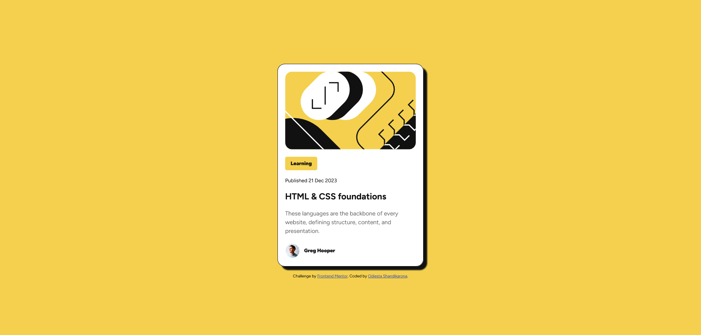
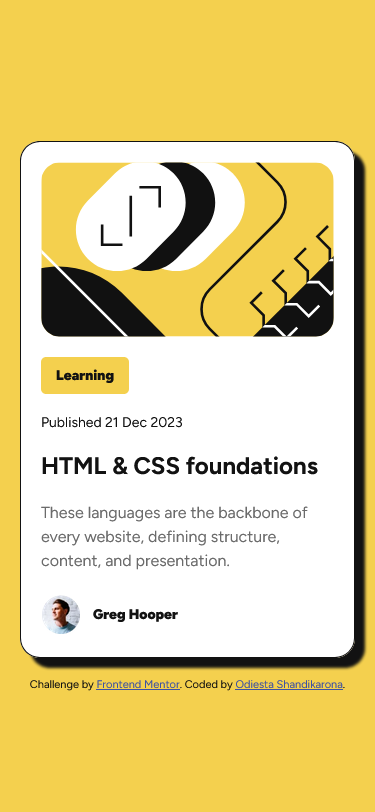

# Frontend Mentor - Blog preview card solution

This is a solution to the [Blog preview card challenge on Frontend Mentor](https://www.frontendmentor.io/challenges/blog-preview-card-ckPaj01IcS). Frontend Mentor challenges help you improve your coding skills by building realistic projects.

## Table of contents

- [Overview](#overview)
  - [The challenge](#the-challenge)
  - [Screenshot](#screenshot)
  - [Links](#links)
- [My process](#my-process)
  - [Built with](#built-with)
  - [What I learned](#what-i-learned)
  - [Continued development](#continued-development)
  - [Useful resources](#useful-resources)
- [Author](#author)

## Overview

### The challenge

Users should be able to:

- See hover and focus states for all interactive elements on the page

### Screenshot

### Links

- Solution URL: [Add solution URL here](https://your-solution-url.com)
- Live Site URL: [Add live site URL here](https://your-live-site-url.com)

## My process

I begin by writing the HTML according to the design, carefully selecting tags and class names based on the content's purpose; then, I focus on mobile design first, setting the font size on the HTML tag to 62.5% to ensure 1rem equals 10px for easier scaling, i use CSS custom properties to create variable for color to make it easier. To make container center i use height: 100vh in the body to make it cover entire display and display flex to center the child element. i use sub-container so that i don't need to set horizontal margin on each element. i set spacing on each element by using margin top so that each element does not have to depend on previous element margin. i use max-width of 40rem so that the container don't widen beyond the appropriate size. for the profile image i use scale to 0.6 to make it smaller, then the margin of the image change. to fix it i set the margin left to -1.2rem.

### Built with

- Semantic HTML5 markup
- CSS custom properties
- Flexbox
- Mobile-first workflow

### What I learned

I've learned that starting with a design file before coding streamlines the process and improves the outcome, as it eliminates the need to decide on layouts, colors, and fonts; creating both desktop and mobile versions simplifies coding, and I now choose technologies based on the project's size and complexity, rather than using Sass for every project.

### Continued development

i want to learn more about styling image because it's often turn out not as i expected.

### Useful resources

- [News Homepage](https://github.com/Odiesta/news-homepage-main) - I use my previously completed challenge to solve identical problem such as setting base setting in font-size, and css reset.

## Author

- Frontend Mentor - [@Odiesta](https://www.frontendmentor.io/profile/Odiesta)
- X - [@OdiestaS](https://x.com/OdiestaS)
